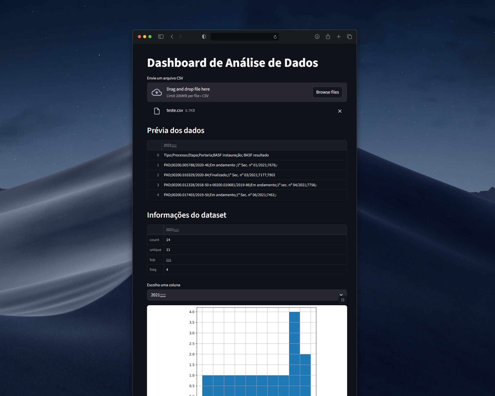

# 📊 Python Data Dashboard

Dashboard de análise de dados desenvolvido em **Python** utilizando **Streamlit**.  
O objetivo do projeto é permitir que usuários façam upload de arquivos CSV e visualizem rapidamente estatísticas e gráficos do dataset.

---

## 🚀 Tecnologias utilizadas

- Python
- Pandas
- Matplotlib
- Streamlit

---

## ⚙️ Funcionalidades

✔ Upload de arquivos CSV  
✔ Visualização das primeiras linhas do dataset  
✔ Estatísticas automáticas dos dados  
✔ Geração de gráficos  
✔ Interface web simples

---

## 📷 Preview do projeto



---

## ▶️ Como executar

Clone o repositório:

```bash
git clone https://github.com/seuusuario/python-data-dashboard.git
